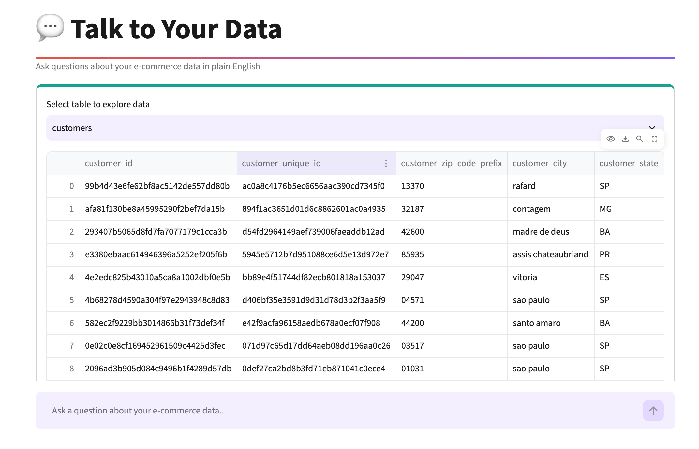
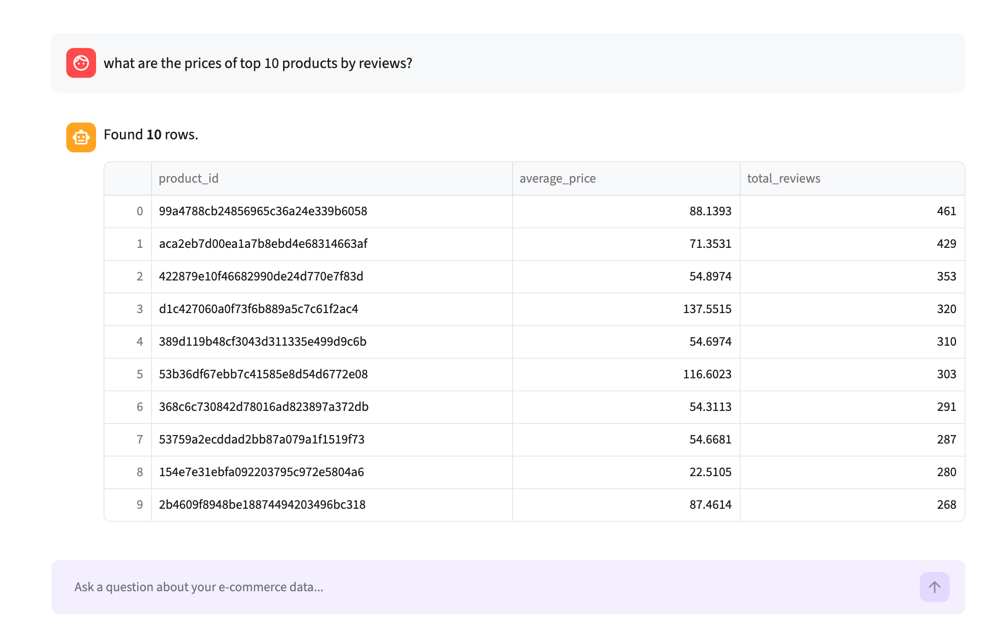
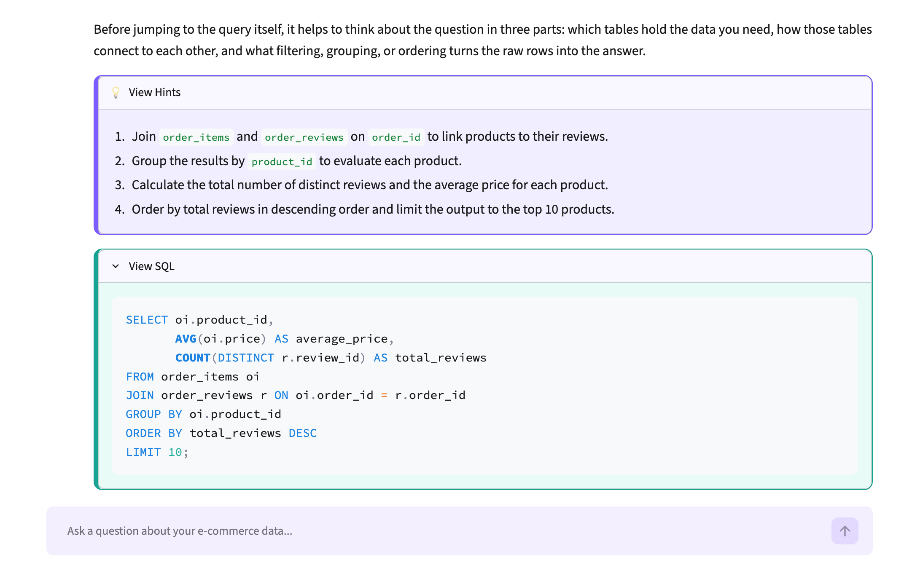
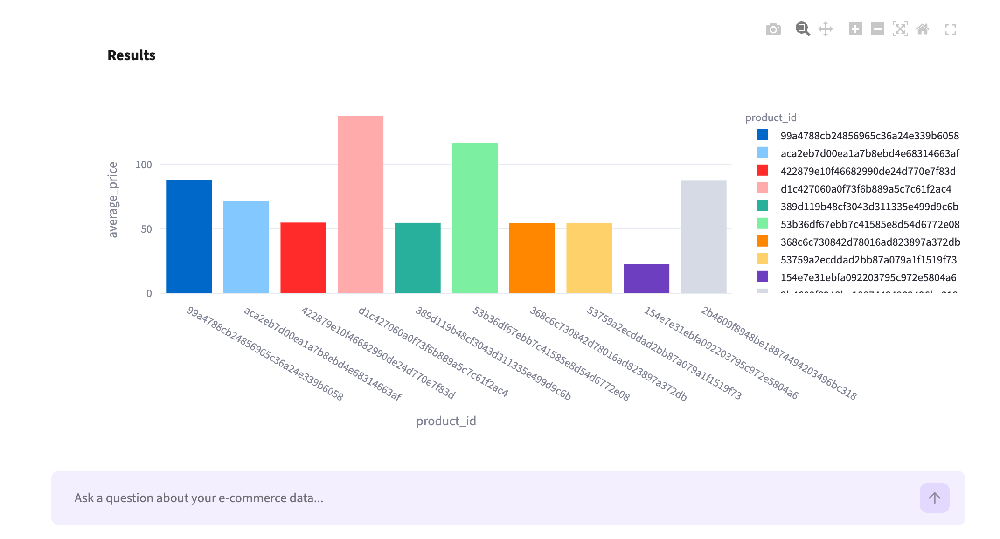

# Talk to Your Data 💬

Ask questions about an e-commerce dataset in plain English and get back SQL, results, and an auto-generated chart. Built with Streamlit, DuckDB, and Google's Gemini API.

<table>
  <tr>
    <td></td>
    <td></td>
  </tr>
  <tr>
    <td></td>
    <td></td>
  </tr>
</table>

## Features

- **Natural language → SQL** — ask a question, Gemini writes the DuckDB query
- **View Hints** — a plain-English, step-by-step breakdown of the query logic
- **View SQL** — the formatted SQL Gemini generated, in a collapsible panel
- **Auto-picked charts** — bar, line, pie, or scatter, chosen based on the shape of the result
- **8 sample questions** in the sidebar that run instantly with no API key required (pre-cached)
- **Per-session limits** — 5 queries per session, session resets automatically after 30 minutes (keeps API usage bounded on a public deployment)

## How it works

1. You ask a question (e.g. "What are the top 10 product categories by revenue?")
2. Gemini converts it into a DuckDB SQL query based on the live schema
3. The query runs against a local DuckDB database
4. Results are shown as a table, with the SQL/hints tucked behind toggles and an auto-picked chart underneath

## Dataset

Real data — the [Olist Brazilian E-Commerce dataset](https://www.kaggle.com/datasets/olistbr/brazilian-ecommerce) from Kaggle (9 tables: customers, orders, order_items, order_payments, order_reviews, products, sellers, geolocation, category translations; ~100K orders spanning 2016–2018). [seed_data.py](seed_data.py) downloads it via `kagglehub` and loads it into DuckDB on first run — no Kaggle account needed.

## Tech stack

- [Streamlit](https://streamlit.io) — UI
- [DuckDB](https://duckdb.org) — local analytical database
- [Google Gemini](https://ai.google.dev) — natural language → SQL
- [Plotly](https://plotly.com/python/) — charts

## Setup

### Prerequisites

- Python 3.10+
- A [Google Gemini API key](https://aistudio.google.com/apikey) (free tier works — needed for free-text questions; the sidebar's sample questions work without one)

### 1. Clone and install dependencies

```bash
git clone https://github.com/ahfaisal122/talk-to-your-data.git
cd talk-to-your-data
python3 -m venv .venv
source .venv/bin/activate   # Windows: .venv\Scripts\activate
pip install -r requirements.txt
```

### 2. Add your API key

Pick one:

**Option A — Streamlit secrets file (recommended for local dev)**

```bash
cp .streamlit/secrets.toml.example .streamlit/secrets.toml
```

Then edit `.streamlit/secrets.toml` and paste your key in place of `"..."`:

```toml
GOOGLE_API_KEY = "your-key-here"
```

**Option B — environment variable**

```bash
export GOOGLE_API_KEY="your-key-here"
```

`.streamlit/secrets.toml` is git-ignored, so your key never gets committed.

### 3. Run the app

```bash
streamlit run app.py
```

Opens at `http://localhost:8501`. On first run, the app downloads the Olist dataset and loads it into a local `ecommerce.duckdb` file — this takes 30–60 seconds; subsequent runs reuse the cached file.

No API key yet? You can still try the 8 sample questions in the sidebar — their SQL is pre-generated and cached in [sample_cache.json](sample_cache.json), so they run instantly without calling Gemini.

### Run in GitHub Codespaces

This repo includes a `.devcontainer` config, so you can also open it in a Codespace and it'll install dependencies and launch `streamlit run app.py` automatically — just add your API key via Codespaces secrets or `.streamlit/secrets.toml` first.

## Project structure

```
.
├── app.py                    # Streamlit UI: chat interface, session/query limits, rendering
├── query_engine.py           # DB access, Gemini prompt + SQL generation, auto-charting
├── seed_data.py               # Downloads the Olist dataset via kagglehub and loads it into DuckDB
├── generate_sample_cache.py  # One-off script that pre-generates SQL for the sidebar sample questions
├── sample_cache.json         # Cached SQL/explanations for the sample questions
├── requirements.txt
├── .streamlit/
│   ├── config.toml               # Theme + server settings
│   └── secrets.toml.example      # Template for your local API key
└── .devcontainer/             # GitHub Codespaces / VS Code dev container config
```


